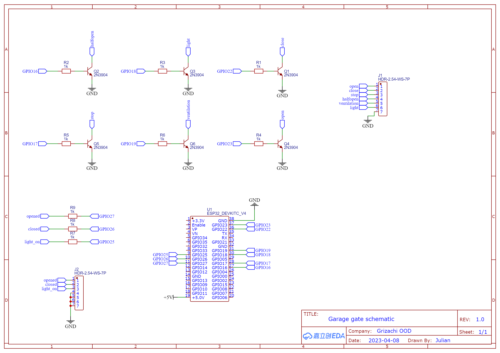
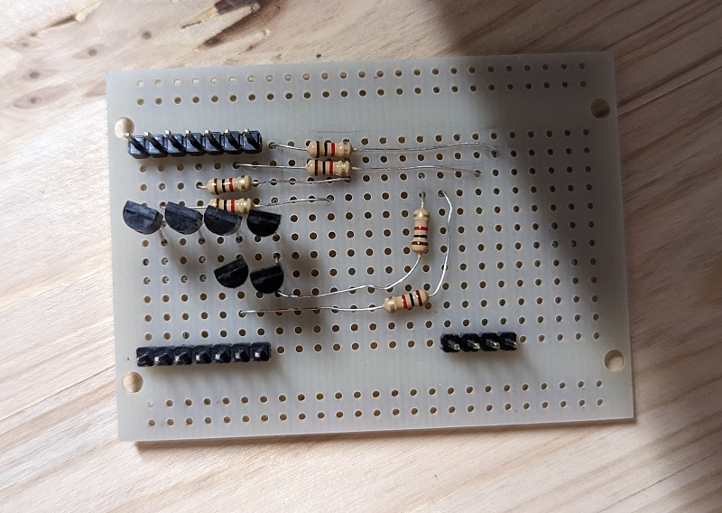
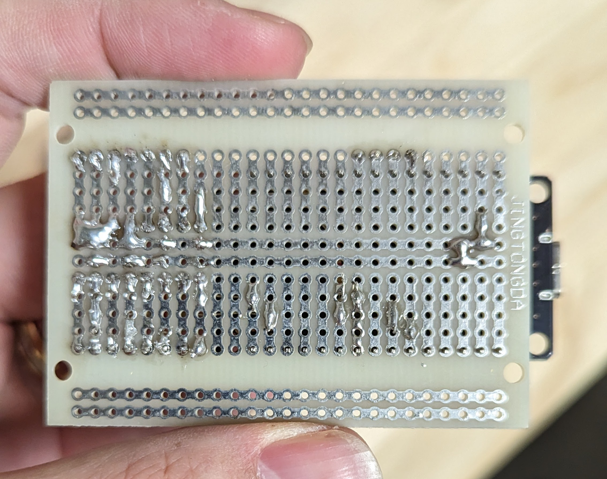
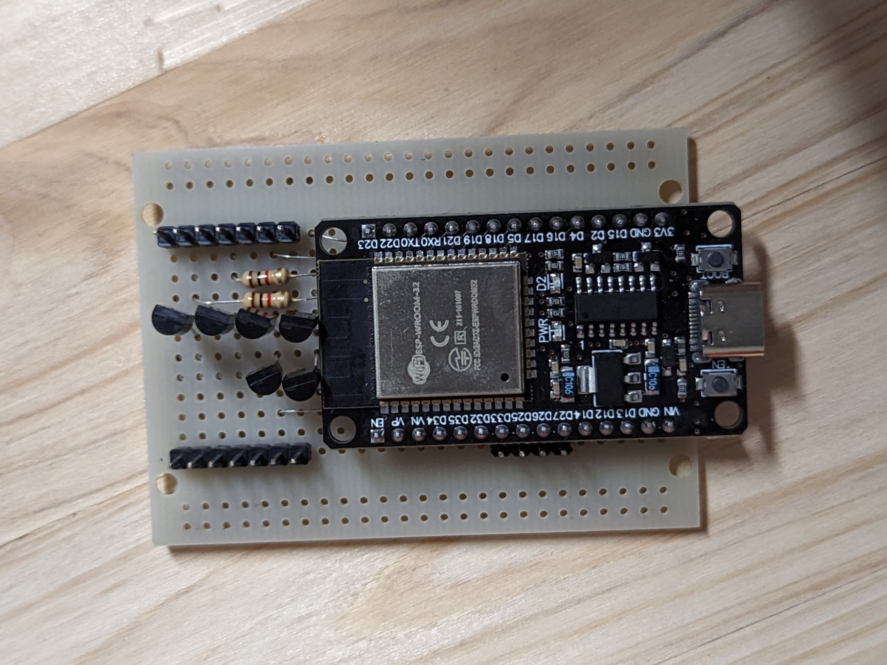

# Garage gate control for Supramatic E4 with UAP1-HCP

Since my garage door uses the SupraMatic E4 drive by Hoermann I wanted to not only have to use the remote or the Bluetooth app they provide to control the door and have it open automatically when I drive home. Therefore I ordered the extension board for that drive called UAP1-HCP which breaks out all controls of the door as pins and also provides the end-state information for the door. It would have been nice if it also provided a more precise position information but maybe if I manage to figure out the communication protocol used between the drive and the breakout board I will be able to get that too as the app can show it.

## BOM

1. 1 x ESP32 DevKit board
2. 9 x 1kΩ resistors
3. 6 x 2N3904 NPN transistors
4. 1 x 24V DC to 5V DC USB converter

## Schematic

This is the schematic of the build:

The inputs of the breakout board are supposed to be driven low to be enabled so I implemented this with some 2N3904 trnaistors to avoid subjecting the ESP32 pins to the voltage that pulls them high which is likely higher than what the ESP32 will like.

The outputs are actually relays that switch between the NO and NC contacts so I connected the common pin to GND and the NO output to a pin of the ESP32 with the internal pull-up set. Note: I have not put the resistors to the input pins as I drew them on the schematic.

### This is the ready board:

## Configuration

This is project requered no custom code as all pins are trivially GPIO driven. The only logic I added is to configure all movement controls to be mutually exclusive.

Position control is very imprecise because the time to close is dominated by the warning time of the drive when it blinks its light but doesn't move.

